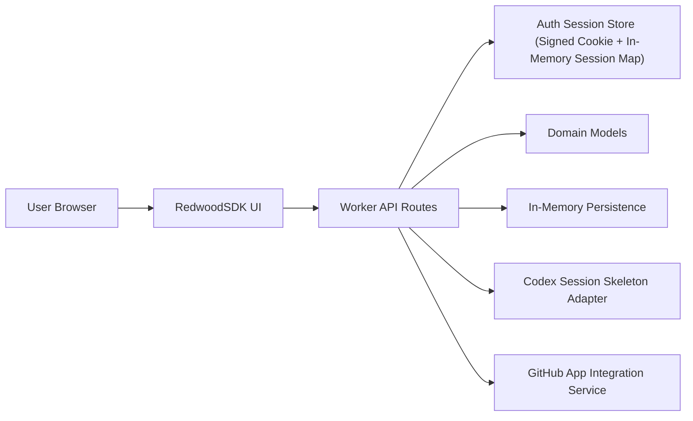

# ScenarioForge Architecture

## 1. Purpose

This document defines concrete service boundaries and API contracts for `ScenarioForge`.

Primary objective:
- Deliver a scenario-first quality platform using RedwoodSDK for UX and Codex app-server for orchestration.

## 2. System Context

Core flow:
1. User signs in with ChatGPT.
2. User connects GitHub repository.
3. User curates source inputs (PRD/specs/plans/code).
4. System generates grouped scenarios.
5. System runs scenarios and captures evidence.
6. System fixes failures and opens PRs.
7. System provides review board output.

## 3. Service Boundaries

### 3.1 Web App (RedwoodSDK)

Responsibilities:
- User-facing workflow and status visibility.
- Trigger actions for source curation, generation, run, fix, and review.
- Display artifacts, run telemetry, and PR outcomes.

Owns:
- View composition.
- Client-side interaction state.
- UX-level validation and action sequencing.

Does not own:
- Long-running job execution.
- Source-of-truth scenario execution state.

### 3.2 API Layer (Worker Routes)

Responsibilities:
- Stateless HTTP endpoint surface for product operations.
- Input validation and response contracts.
- Delegation to domain and service modules.

Owns:
- Endpoint contracts.
- Auth/session checks and ownership enforcement.

### 3.3 Domain Layer

Responsibilities:
- Canonical entities and invariants.
- Decision-safe object shapes for project/scenario/session records.

Owns:
- `Project`, `CodexSession`, `AuthPrincipal`, and `GitHubConnection` models in Phase 1.

### 3.4 Persistence Adapter

Responsibilities:
- Store/retrieve domain entities.
- Hide storage implementation details from API handlers.

Phase 1 implementation:
- In-memory runtime store (worker process memory) for projects/sessions/principals/connections.
- Session map-backed signed cookie auth session store.

Planned upgrades:
- Durable storage adapter (D1 or equivalent).
- Artifact/object storage for evidence bundles.

### 3.5 Codex Orchestration Adapter

Responsibilities:
- Build JSON-RPC payloads for Codex app-server lifecycle.
- Track local session metadata.
- Provide transition point to real app-server transport bridge.

Phase 0 implementation:
- Session skeleton with `initialize` and `thread/start` payload blueprints.

Planned upgrades:
- Full transport bridge (stdio/ws relay service).
- Turn streaming and review mode ingestion.

### 3.6 GitHub Integration Service

Responsibilities:
- Repository linking.
- Branch management.
- PR creation/update.

Phase 1 implementation:
- GitHub App installation connect flow.
- App JWT signing + installation token exchange.
- Installation repository listing for project source selection.

## 4. Runtime Architecture (Phase 1)



Notes:
- This phase adds auth state, ownership checks, and GitHub App installation connect.
- Persistence remains in-memory and is non-durable across runtime restarts.

## 5. API Contracts (Phase 1)

## 5.1 `GET /api/health`

Purpose:
- Service sanity and version state.

Response `200`:
```json
{
  "ok": true,
  "service": "scenarioforge-api",
  "phase": "phase-1",
  "timestamp": "2026-02-23T10:00:00.000Z"
}
```

## 5.2 `GET /api/auth/session`

Purpose:
- Retrieve current ChatGPT auth state for the requester.

Response `200`:
```json
{
  "authenticated": true,
  "principal": {
    "id": "usr_...",
    "provider": "chatgpt",
    "displayName": "ScenarioForge Builder",
    "email": "builder@example.com"
  }
}
```

## 5.3 `POST /api/auth/chatgpt/sign-in`

Purpose:
- Create/update a ChatGPT principal and establish a signed session cookie.

## 5.4 `POST /api/auth/sign-out`

Purpose:
- Remove the current auth session and clear session cookie.

## 5.5 `GET /api/projects`

Purpose:
- List tracked ScenarioForge projects.

Response `200`:
```json
{
  "data": [
    {
      "id": "proj_...",
      "ownerId": "usr_...",
      "name": "ScenarioForge",
      "repoUrl": "https://github.com/org/repo",
      "defaultBranch": "main",
      "status": "active",
      "createdAt": "...",
      "updatedAt": "..."
    }
  ]
}
```

## 5.6 `POST /api/projects`

Purpose:
- Create a project shell.

Request body:
```json
{
  "name": "ScenarioForge",
  "repoUrl": "https://github.com/org/repo",
  "defaultBranch": "main"
}
```

Response `201`:
```json
{
  "project": {
    "id": "proj_...",
    "ownerId": "usr_...",
    "name": "ScenarioForge",
    "repoUrl": "https://github.com/org/repo",
    "defaultBranch": "main",
    "status": "active",
    "createdAt": "...",
    "updatedAt": "..."
  }
}
```

Validation:
- `name` required.
- `defaultBranch` defaults to `main`.
- caller must be authenticated.

## 5.7 `GET /api/codex/sessions`

Purpose:
- List created Codex session records.

Response `200`:
```json
{
  "data": [
    {
      "id": "cxs_...",
      "ownerId": "usr_...",
      "projectId": "proj_...",
      "status": "initialized",
      "transport": "skeleton",
      "createdAt": "...",
      "updatedAt": "...",
      "initializeRequest": {
        "method": "initialize",
        "id": 1,
        "params": {
          "clientInfo": {
            "name": "scenarioforge_web",
            "title": "ScenarioForge Web",
            "version": "0.1.0"
          }
        }
      }
    }
  ]
}
```

## 5.8 `POST /api/codex/sessions`

Purpose:
- Create a Codex session skeleton for a project.

Request body:
```json
{
  "projectId": "proj_..."
}
```

Response `201`:
```json
{
  "session": {
    "id": "cxs_...",
    "ownerId": "usr_...",
    "projectId": "proj_...",
    "status": "initialized",
    "transport": "skeleton",
    "createdAt": "...",
    "updatedAt": "...",
    "initializeRequest": {
      "method": "initialize",
      "id": 1,
      "params": {
        "clientInfo": {
          "name": "scenarioforge_web",
          "title": "ScenarioForge Web",
          "version": "0.1.0"
        }
      }
    },
    "threadStartRequest": {
      "method": "thread/start",
      "id": 2,
      "params": {
        "model": "gpt-5.1-codex",
        "approvalPolicy": "unlessTrusted",
        "sandbox": "workspaceWrite"
      }
    },
    "preferredModels": {
      "research": "codex spark",
      "implementation": "gpt-5.3-xhigh"
    }
  }
}
```

Validation:
- `projectId` required and must exist.
- caller must own project.

## 5.9 `GET /api/github/connect/start`

Purpose:
- Create a state token and return GitHub App installation URL.

## 5.10 `POST /api/github/connect`

Purpose:
- Connect a GitHub App installation by `installationId` and persist repository list for the signed-in principal.

## 5.11 `GET /api/github/repos`

Purpose:
- Return repositories available from the connected installation.

## 5.12 `GET /api/github/connection`

Purpose:
- Return metadata about the current principal's GitHub connection.

## 6. Data Contracts

## 6.1 `Project`

```ts
interface Project {
  id: string;
  name: string;
  repoUrl: string | null;
  defaultBranch: string;
  status: "draft" | "active";
  createdAt: string;
  updatedAt: string;
}
```

## 6.2 `CodexSession`

```ts
interface CodexSession {
  id: string;
  projectId: string;
  status: "initialized" | "thread-ready";
  transport: "skeleton";
  createdAt: string;
  updatedAt: string;
  initializeRequest: JsonRpcRequest;
  threadStartRequest: JsonRpcRequest;
  preferredModels: {
    research: string;
    implementation: string;
  };
}
```

## 7. Security Boundaries

Current:
- No secret values are persisted in code.
- API routes validate required inputs.

Planned:
- ChatGPT auth via Codex app-server account methods.
- GitHub App auth with least privilege.
- Audit logs for scenario run and fix actions.

## 8. Transition Plan (Phase 0 -> Phase 1+)

1. Replace in-memory persistence with durable DB adapter.
2. Add auth middleware and user-session ownership checks.
3. Introduce Codex transport bridge service for live JSON-RPC streams.
4. Add source relevance engine and generation job orchestration.

## 9. External References

- Codex App Server: [https://developers.openai.com/codex/app-server/](https://developers.openai.com/codex/app-server/)
- Codex Authentication: [https://developers.openai.com/codex/auth/](https://developers.openai.com/codex/auth/)
- RedwoodSDK docs: [https://docs.rwsdk.com/](https://docs.rwsdk.com/)
- GitHub Apps docs: [https://docs.github.com/en/apps/creating-github-apps/setting-up-a-github-app/about-creating-github-apps](https://docs.github.com/en/apps/creating-github-apps/setting-up-a-github-app/about-creating-github-apps)
